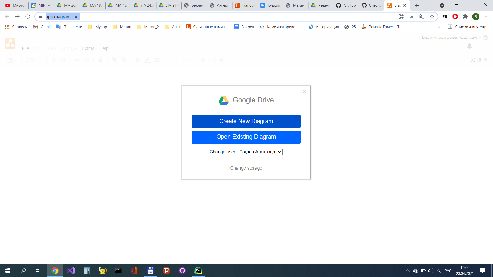
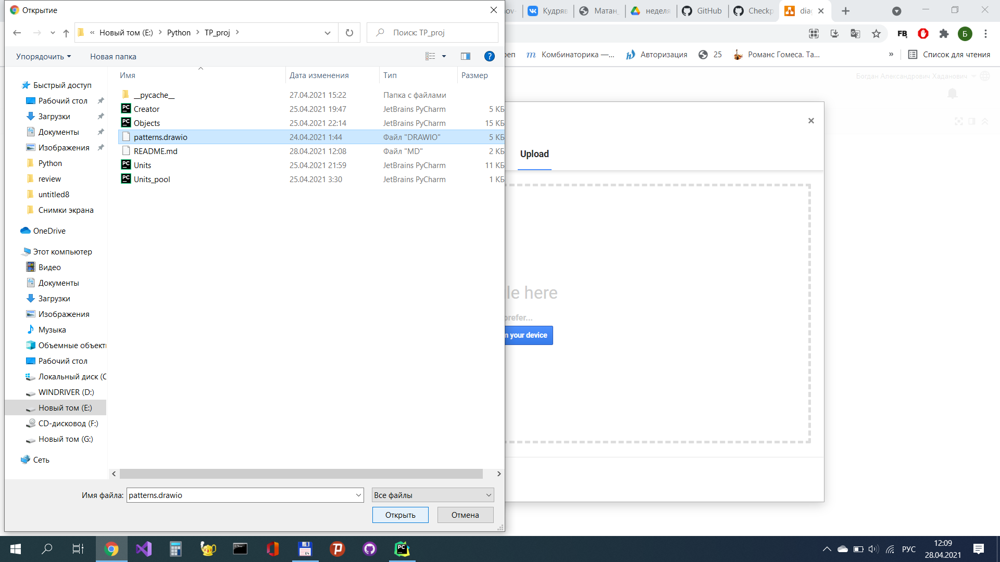

# Диаграмма UML
[https://app.diagrams.net/](https://app.diagrams.net/)

Загрузите файл на Google диск, после чего сможете просматривать диаграмму

# Список команд
## move
move  принимает в аргументы имя героя и город, в который вы хотите его отправить.
## attack
attack  принимает в аргументы имя героя, армией которого вы хотить атаковать чужой город, и название города, который вы хотите атаковать.   
## replace
replace получает в аргументы название объета1, название объекта2, название юнита и их количество. Переводит указанное количество юнитов из армии объекта1 в армию объета2
## buy
buy принимает в аргументы количество юнитов(р), название юнита, и объект, армию которого вы хотите пополнить. Команда пополняет армию объекта р юнитами.
## info
info печатает количество золота у игрока, текущее местоположение, замки игрока и героя игрока.
## army
army принимает в аргументы название объекта, армию которого вы хотите просмотреть и печатает армию.
## map
map печатает состояние карты
# Некоторые примеры запуска команд:
    army Warrior0

    buy 4 Footman Castle1

    replace Castle1 Warrior0 3 Footman

    attack Castle2

    
